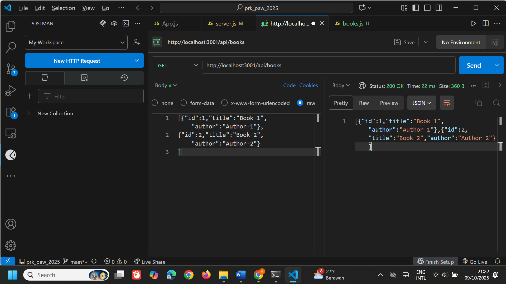
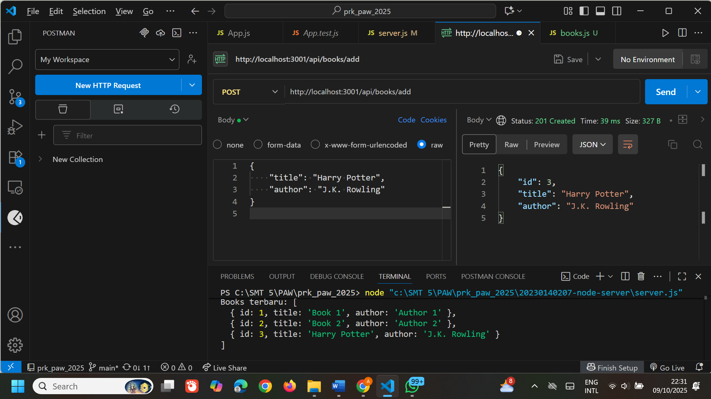
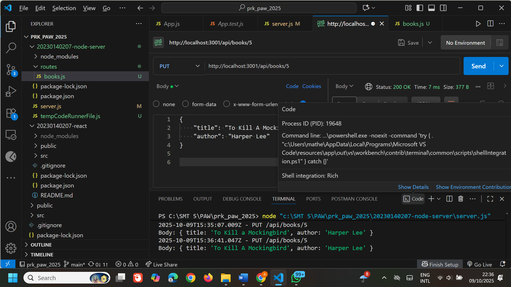
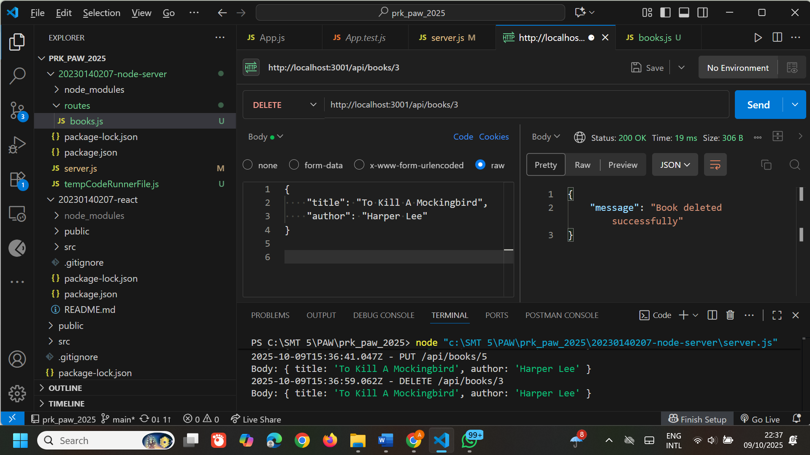

# 📚 Tugas 2 - CRUD Express.js

## 👀 GET /api/books
Menampilkan seluruh data buku yang tersimpan pada server.

---

## ➕ POST /api/books
Menambahkan data buku baru ke dalam daftar buku.

---

## ✏️ PUT /api/books/:id
Memperbarui data buku berdasarkan ID yang dipilih.

---

## ❌ DELETE /api/books/:id
Menghapus data buku berdasarkan ID yang dipilih.

---

