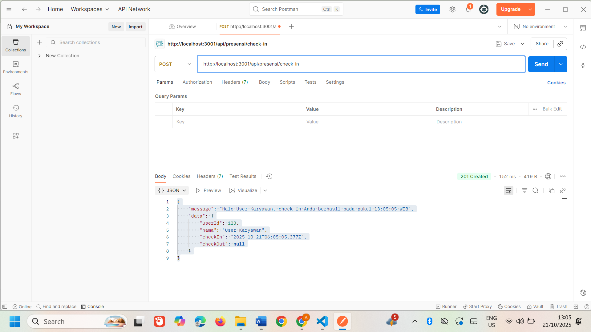
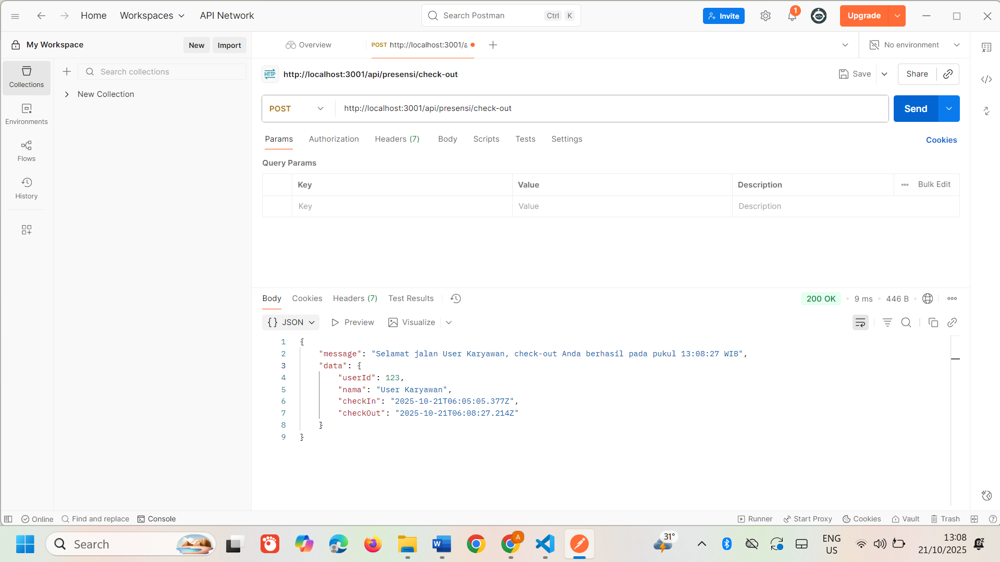

# 📝 Tugas 3 - Endpoint API

## 👋 POST /api/presensi/check-in
Melakukan check-in karyawan.

---

## 🔁 POST /api/presensi/check-in (lebih dari 1 kali)
Cek validasi: tidak boleh check-in lebih dari sekali.

---

## 👋 POST /api/presensi/check-out
Melakukan check-out karyawan.

---

## ⛔ POST /api/presensi/check-out (belum check-in)
Cek validasi: tidak bisa check-out sebelum melakukan check-in.

---

## 📊 GET /api/reports/daily (hanya admin)
Menampilkan laporan presensi harian untuk admin.
.png)
