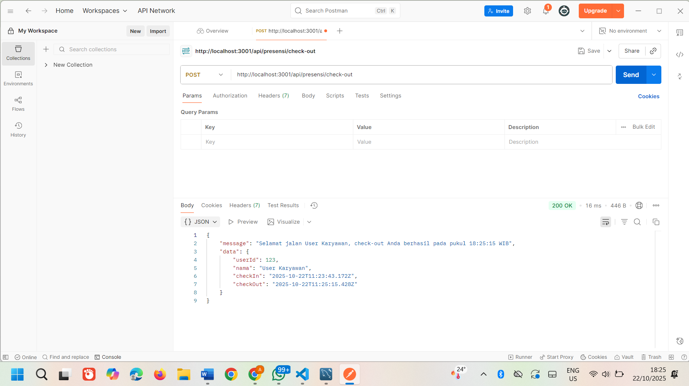

Tugas 4 - Koneksi Database & ORM Sequelize
POST /api/presensi/check-in

Menambahkan data presensi baru (check-in) ke dalam database.

POST /api/presensi/check-out

Melakukan proses check-out dan memperbarui data presensi user yang sedang aktif.

Database Setelah Presensi

Menampilkan isi tabel presensis di database praktikum_20230140207_db setelah proses check-in dan check-out.

GET /api/presensi

Menampilkan seluruh data presensi yang tersimpan di database.
