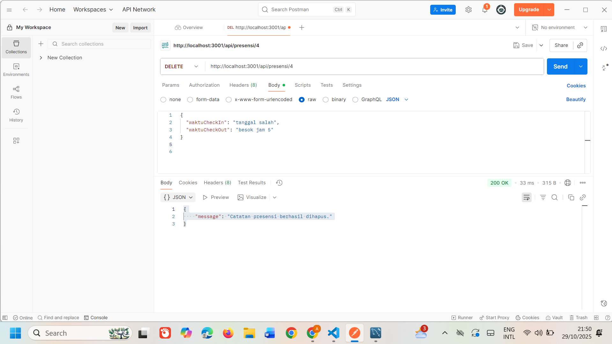

Tugas 5 - CRUD Rest API

PUT http://localhost:3001/api/presensi/:id

Endpoint update data presensi

PUT http://localhost:3001/api/presensi/:id

Endpoint update jika format tanggal yang diisi tidak valid

DELETE http://localhost:3001/api/presensi/:id

Endpoint delete data by id

GET http://localhost:3001/api/reports/daily?nama=

Enpoint search berdasarkan nama

GET http://localhost:3001/api/reports/daily?tanggalMulai=2025-10-28&tanggalSelesai=2025-10-29

Endpoint search berdasarkan tanggal
