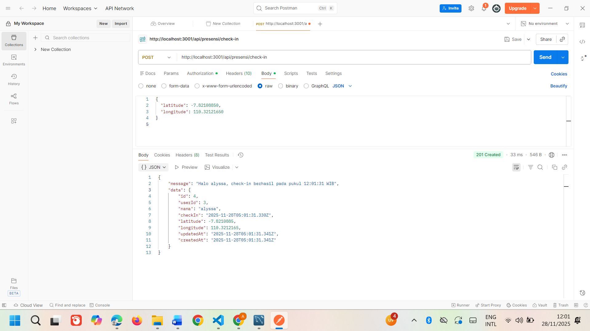
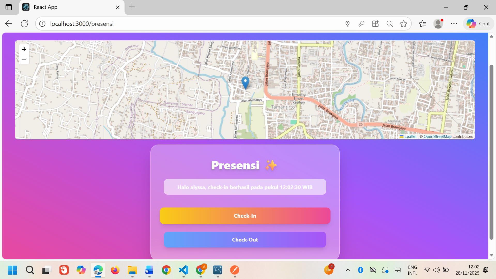
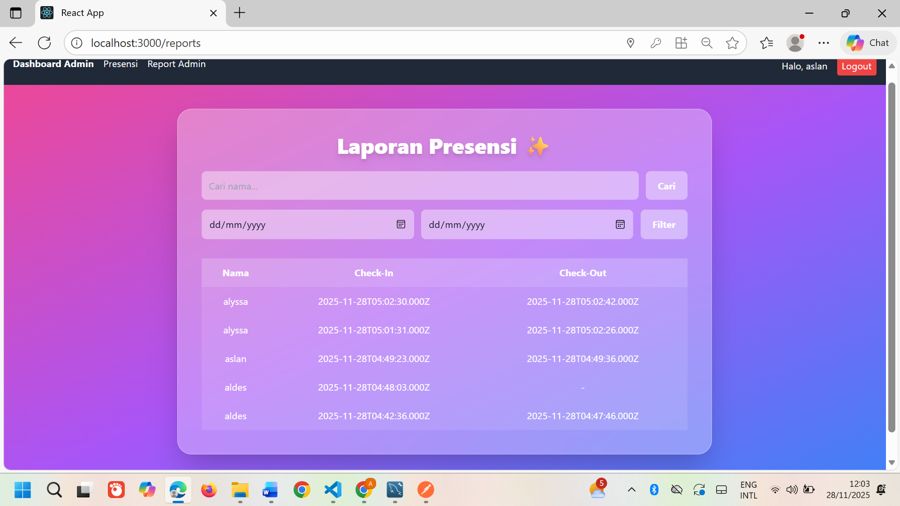
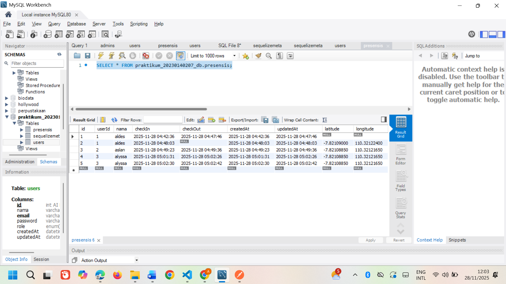

Tugas 9 Praktikum PAW 

Endpoint presensi/check-in dengan menggunakan bearer token dan body latitude, longitude

Tampilan halaman presensi dengan menampilkan maps OSM:
Check-in berhasil

Check-out berhasil

Tampilan halaman report yg berisi data presensi dari semua user

Screenshote tabel presensi di database
